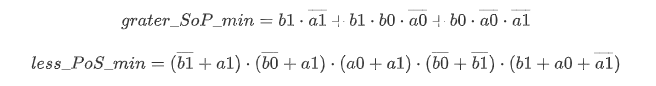
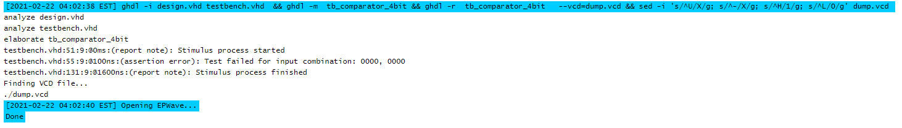

# 02-logic

## 01

| Dec. equivalent |	B[1:0] |	A[1:0]	| B is greater than A |	B equals A |	B is less than A |
| ------------- | ------------- | ------------- | ------------- | ------------- | ------------- |
| 0 | 0 0 | 0 0 | 0 | 1 | 0|
| 1 | 0 0 | 0 1 | 0 | 0 | 1|
| 2 | 0 0 | 1 0 | 0 | 0 | 1|
| 3 | 0 0 | 1 1 | 0 | 0 | 1|
| 4 | 0 1 | 0 0 | 1 | 0 | 0|
| 5 | 0 1 | 0 1 | 0 | 1 | 0|
| 6 | 0 1 | 1 0 | 0 | 0 | 1|
| 7 | 0 1 | 1 1 | 0 | 0 | 1|
| 8 | 1 0 | 0 0 | 1 | 0 | 0|
| 9 | 1 0 | 0 1 | 1 | 0 | 0|
| 10 | 1 0 | 1 0 | 0 | 1 | 0|
| 11 | 1 0 | 1 1 | 0 | 0 | 1|
| 12 | 1 1 | 0 0 | 1 | 0 | 0|
| 13 | 1 1 | 0 1 | 1 | 0 | 0|
| 14 | 1 1 | 1 0 | 1 | 0 | 0|
| 15 | 1 1 | 1 1 | 0 | 1 | 0|

## 02

**B equals A**


| A1 A0<br />B1 B0 |   00    |   01    |   11    |   10    |
| :----: | :-----: | :-----: | :-----: | :-----: |
| **00** | ***1*** |    0    |    0    |    0    |
| **01** |    0    | ***1*** |    0    |    0    |
| **11** |    0    |    0    | ***1*** |    0    |
| **10** |    0    |    0    |    0    | ***1*** |

**B is greater than A**

| A1 A0<br />B1 B0 |   00    |   01    |  11  |   10    |
| :--------------: | :-----: | :-----: | :--: | :-----: |
|      **00**      |    0    |    0    |  0   |    0    |
|      **01**      | ***1*** |    0    |  0   |    0    |
|      **11**      | ***1*** | ***1*** |  0   | ***1*** |
|      **10**      | ***1*** | ***1*** |  0   |    0    |

**B is less than A**

| A1 A0<br />B1 B0 |  00  |   01    |   11    |   10    |
| :--------------: | :--: | :-----: | :-----: | :-----: |
|      **00**      |  0   | ***1*** | ***1*** | ***1*** |
|      **01**      |  0   |    0    | ***1*** | ***1*** |
|      **11**      |  0   |    0    |    0    |    0    |
|      **10**      |  0   |    0    | ***1*** |    0    |




**Link to playground:**

https://www.edaplayground.com/x/8TNV

## 03

**design.vhd**

```vhdl
library ieee;
use ieee.std_logic_1164.all;

entity comparator_4bit is
    port(
        a_i			: in  std_logic_vector(4 - 1 downto 0);         
        b_i			: in  std_logic_vector(4 - 1 downto 0);        
        
        B_greater_A_o    : out std_logic;        
       	B_equals_A_o    : out std_logic;
        B_less_A_o		: out std_logic
    );
end entity comparator_4bit;

architecture Behavioral of comparator_4bit is
begin
    B_greater_A_o  <= '1' when (b_i > a_i) else '0';
    B_equals_A_o  <= '1' when (b_i = a_i) else '0';
    B_less_A_o    <= '1' when (b_i < a_i) else '0';

end architecture Behavioral;
```

testbech.vhd****

```vhdl
library ieee;
use ieee.std_logic_1164.all;


entity tb_comparator_4bit is

end entity tb_comparator_4bit;

-----------------------------------------------------------------------
-- Architecture body for testbench
------------------------------------------------------------------------
architecture testbench of tb_comparator_4bit is

    -- Local signals
    signal s_a       : std_logic_vector(4 - 1 downto 0);
    signal s_b       : std_logic_vector(4 - 1 downto 0);
    signal s_B_greater_A : std_logic;
    signal s_B_equals_A  : std_logic;
    signal s_B_less_A    : std_logic;

begin
    -- Connecting testbench signals with comparator_2bit entity (Unit Under Test)
    uut_comparator_2bit : entity work.comparator_4bit
        port map(
            a_i           => s_a,
            b_i           => s_b,
            B_greater_A_o => s_B_greater_A,
            B_equals_A_o  => s_B_equals_A,
            B_less_A_o    => s_B_less_A
        );

    --------------------------------------------------------------------
    -- Data generation process
    --------------------------------------------------------------------
    p_stimulus : process
    begin
        -- Report a note at the begining of stimulus process
        report "Stimulus process started" severity note;


        s_b <= "0000"; s_a <= "0000"; wait for 100 ns;
        assert ((s_B_greater_A = '1') and (s_B_equals_A = '0') and (s_B_less_A = '0'))
        report "Test failed for input combination: 0000, 0000" severity error;


        s_b <= "0000"; s_a <= "0001"; wait for 100 ns;
        assert ((s_B_greater_A = '0') and (s_B_equals_A = '0') and (s_B_less_A = '1'))
        report "Test failed for input combination: 0000, 0001" severity error;
        
       
        s_b <= "0000"; s_a <= "0010"; wait for 100 ns;
        assert ((s_B_greater_A = '0') and (s_B_equals_A = '0') and (s_B_less_A = '1'))
        report "Test failed for input combination: 0000, 0010" severity error;
               
        s_b <= "0000"; s_a <= "0011"; wait for 100 ns;
        assert ((s_B_greater_A = '0') and (s_B_equals_A = '0') and (s_B_less_A = '1'))
        report "Test failed for input combination: 0000, 0011" severity error;
        
        s_b <= "0001"; s_a <= "0000"; wait for 100 ns;
        assert ((s_B_greater_A = '1') and (s_B_equals_A = '0') and (s_B_less_A = '0'))
        report "Test failed for input combination: 0001, 0000" severity error;


        s_b <= "0001"; s_a <= "0001"; wait for 100 ns;
        assert ((s_B_greater_A = '0') and (s_B_equals_A = '1') and (s_B_less_A = '0'))
        report "Test failed for input combination: 0001, 0001" severity error;
        
       
        s_b <= "0001"; s_a <= "0010"; wait for 100 ns;
        assert ((s_B_greater_A = '0') and (s_B_equals_A = '0') and (s_B_less_A = '1'))
        report "Test failed for input combination: 0001, 0010" severity error;
               
        s_b <= "0001"; s_a <= "0011"; wait for 100 ns;
        assert ((s_B_greater_A = '0') and (s_B_equals_A = '0') and (s_B_less_A = '1'))
        report "Test failed for input combination: 0001, 0011" severity error;
                
        s_b <= "0010"; s_a <= "0000"; wait for 100 ns;
        assert ((s_B_greater_A = '1') and (s_B_equals_A = '0') and (s_B_less_A = '0'))
        report "Test failed for input combination: 0010, 0000" severity error;


        s_b <= "0010"; s_a <= "0001"; wait for 100 ns;
        assert ((s_B_greater_A = '1') and (s_B_equals_A = '0') and (s_B_less_A = '0'))
        report "Test failed for input combination: 0010, 0001" severity error;
        
       
        s_b <= "0010"; s_a <= "0010"; wait for 100 ns;
        assert ((s_B_greater_A = '0') and (s_B_equals_A = '1') and (s_B_less_A = '0'))
        report "Test failed for input combination: 0010, 0010" severity error;
               
        s_b <= "0010"; s_a <= "0011"; wait for 100 ns;
        assert ((s_B_greater_A = '0') and (s_B_equals_A = '0') and (s_B_less_A = '1'))
        report "Test failed for input combination: 0010, 0011" severity error;
        
        s_b <= "0011"; s_a <= "0000"; wait for 100 ns;
        assert ((s_B_greater_A = '1') and (s_B_equals_A = '0') and (s_B_less_A = '0'))
        report "Test failed for input combination: 0011, 0000" severity error;


        s_b <= "0011"; s_a <= "0001"; wait for 100 ns;
        assert ((s_B_greater_A = '1') and (s_B_equals_A = '0') and (s_B_less_A = '0'))
        report "Test failed for input combination: 0011, 0001" severity error;
        
       
        s_b <= "0011"; s_a <= "0010"; wait for 100 ns;
        assert ((s_B_greater_A = '1') and (s_B_equals_A = '0') and (s_B_less_A = '0'))
        report "Test failed for input combination: 0011, 0010" severity error;
               
        s_b <= "0011"; s_a <= "0011"; wait for 100 ns;
        assert ((s_B_greater_A = '0') and (s_B_equals_A = '1') and (s_B_less_A = '0'))
        report "Test failed for input combination: 0011, 0011" severity error;

        report "Stimulus process finished" severity note;
        wait;
    end process p_stimulus;

end architecture testbench;

```

**Console output:**



**Link to playground:**

https://www.edaplayground.com/x/Dsfr


<!--

ddd


```vhdl
f b=a = not b1 * not b2 * not a1 * not a0  +  not b1 * b0 * a1 * a0  +   b1* not b0 * a1 * not a0 +   b1* b0 * a1 * a0

g b<a = 
( b1 + b0 + a1 + a0 ) *
( b1 + not b0 + a1 + a0 ) *
( b1 + not b0 + a1 + not a0 ) *
( not b1 + b0 + a1 + a0 ) *
( not b1 + b0 + a1 + not a0 ) *
( not b1 + b0 + not a1 + a0 ) *
( not b1 + not b0 + a1 + a0 ) *
( not b1 + not b0 + a1 + not a0 ) *
( not b1 + not b0 + not a1 + a0 ) *
( not b1 + not b0 + not a1 + not a0 ) *


grater_SoP_min = b1 * not a1 + b1 * b0 * not a0 + b0 * not a0 * not a1 = 

    less_PoS_min = ( not b1 + a1 ) * (not b0 + a1) * (a0 + a1) * (not b0 + not b1) * ( b1 + a0 + not a1)
    
    (/a0 + /b1)
 

```

$$
grater\_SoP\_min = b1 \cdot \overline{a1} + b1 \cdot b0 \cdot \overline{a0} + b0 \cdot \overline{a0} \cdot \overline{a1}
$$

$$
less\_PoS\_min = (\overline{b1} + a1 ) \cdot (\overline{b0} + a1) \cdot (a0 + a1) \cdot (\overline{b0} + \overline{b1}) \cdot ( b1 + a0 + \overline{a1})
$$

-->