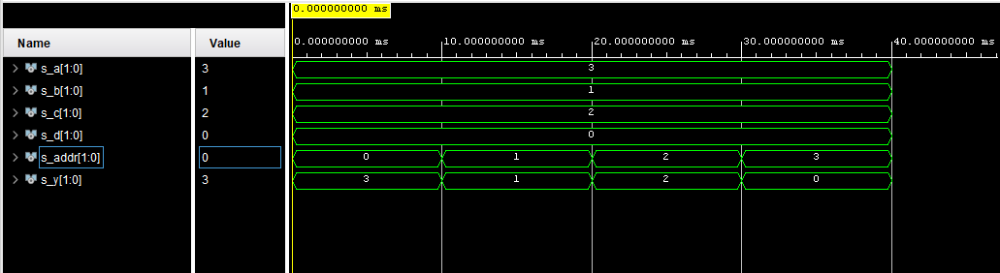

# 03-vivado

## 01 Connection of LEDs and switches

| Součástka | Sériový rezistor | I/O port na Nexys A7 |
| --------- | ---------------- | -------------------- |
| SW0       | 10k              | J15                  |
| SW1       | 10k              | L16                  |
| SW2       | 10k              | M13                  |
| SW3       | 10k              | R15                  |
| SW4       | 10k              | R17                  |
| SW5       | 10k              | T18                  |
| SW6       | 10k              | U18                  |
| SW7       | 10k              | R13                  |
| SW8       | 10k              | T8                   |
| SW9       | 10k              | U8                   |
| SW10      | 10k              | R16                  |
| SW11      | 10k              | T13                  |
| SW12      | 10k              | H6                   |
| SW13      | 10k              | U12                  |
| SW14      | 10k              | U11                  |
| SW15      | 10k              | V10                  |
| LD0       | 330              | H17                  |
| LD1       | 330              | K15                  |
| LD2       | 330              | J13                  |
| LD3       | 330              | N14                  |
| LD4       | 330              | R18                  |
| LD5       | 330              | V17                  |
| LD6       | 330              | U17                  |
| LD7       | 330              | U16                  |
| LD8       | 330              | V16                  |
| LD9       | 330              | T15                  |
| LD10      | 330              | U14                  |
| LD11      | 330              | T16                  |
| LD12      | 330              | V15                  |
| LD13      | 330              | V14                  |
| LD14      | 330              | V12                  |
| LD15      | 330              | V11                  |

## 02 multiplexer

**VHDL architecture**

```vhdl
architecture testbench of mux_2bit_new is
begin
   y_o <= a_i when (addr_i = "00") else
          b_i when (addr_i = "01") else
          c_i when (addr_i = "10") else
          d_i;  
end architecture testbench;
```

**VHDL stimulus process**

```vhdl
           p_stimulus : process
           begin
                
                s_a <= "11"; 
                s_b <= "01";  
                s_c <= "10"; 
                s_d <= "00";
                
                s_addr <= "00"; 
                wait for 10ms;
                s_addr <= "01"; 
                wait for 10ms;
                s_addr <= "10"; 
                wait for 10ms;
                s_addr <= "11"; 
                wait for 10ms;
                
                wait;
           end process p_stimulus;
```

**Console output:**



## 3 Tutorial

Start **Vivado** in folder **Xilinx Design**.
*It takes same time - very long time - before something happens and the software starts.*

**QUICK START**

- **Open Project** - and open old project

- **Create Project**
- **Next** to the second page
  - Enter **Project name** and choose **Project location** in *D:/Documents/Rubinek/Digital-electronics-1/*... and **Next**.
  - **Next**
  - Add sources **Create File** and type **File name**. All filetypes **VHDL** and **Next**.
  - Switch to tab **Boards** and choose **Nexys A7-50T** and **Next**.
  - Now should be the project ready by clicking the button **Finish**.
  - With a bit of luck after a few seconds project should by ready and appears a **Define Module** window. Just click **OK** and confirm by **Yes** and do not care.
- In upper left sub-window appeared in **Design Sources** your file. Dubble clickign it you can begin to create design of your program.
- To test the program you need to add file to **Simulation Sources**. You can create it by clicking **"PLUS"** symbol upwards or in **File > Add Sources**-
  - You of course want to create **Simulation sources** and confirm it by clicking **Next**.
  - Same as before sources **Create File** and type **File name** (often *"tb_andHereYoutName"* - testbench). All filetypes **VHDL** and **Finish**.
  - With a two bits of luck after a few seconds project should by ready and appears a **Define Module** window. Just click **OK** and confirm by **Yes** and do not care.
- To run simulation you need to follow **Flow > Run Simulation >  Run Behavioural Simulation**. Now make a cup of tea, coffee or drink a glass of wine, it will  take forever.
  - When it's done, in right window appears the simulation. It doesn't appear whole. You can solve it by clicking **Zoom Fit** button in simulation window. 
  - When the simulation time is too long or too short and you can't see what you would like too even after zoom fitting, change simulation time in menu bar and rerun simulation by blue play leftwards.

<!--

ddd


```vhdl
f b=a = not b1 * not b2 * not a1 * not a0  +  not b1 * b0 * a1 * a0  +   b1* not b0 * a1 * not a0 +   b1* b0 * a1 * a0

g b<a = 
( b1 + b0 + a1 + a0 ) *
( b1 + not b0 + a1 + a0 ) *
( b1 + not b0 + a1 + not a0 ) *
( not b1 + b0 + a1 + a0 ) *
( not b1 + b0 + a1 + not a0 ) *
( not b1 + b0 + not a1 + a0 ) *
( not b1 + not b0 + a1 + a0 ) *
( not b1 + not b0 + a1 + not a0 ) *
( not b1 + not b0 + not a1 + a0 ) *
( not b1 + not b0 + not a1 + not a0 ) *


grater_SoP_min = b1 * not a1 + b1 * b0 * not a0 + b0 * not a0 * not a1 = 

    less_PoS_min = ( not b1 + a1 ) * (not b0 + a1) * (a0 + a1) * (not b0 + not b1) * ( b1 + a0 + not a1)
    
    (/a0 + /b1)
 

```

$$
grater\_SoP\_min = b1 \cdot \overline{a1} + b1 \cdot b0 \cdot \overline{a0} + b0 \cdot \overline{a0} \cdot \overline{a1}
$$

$$
less\_PoS\_min = (\overline{b1} + a1 ) \cdot (\overline{b0} + a1) \cdot (a0 + a1) \cdot (\overline{b0} + \overline{b1}) \cdot ( b1 + a0 + \overline{a1})
$$

-->