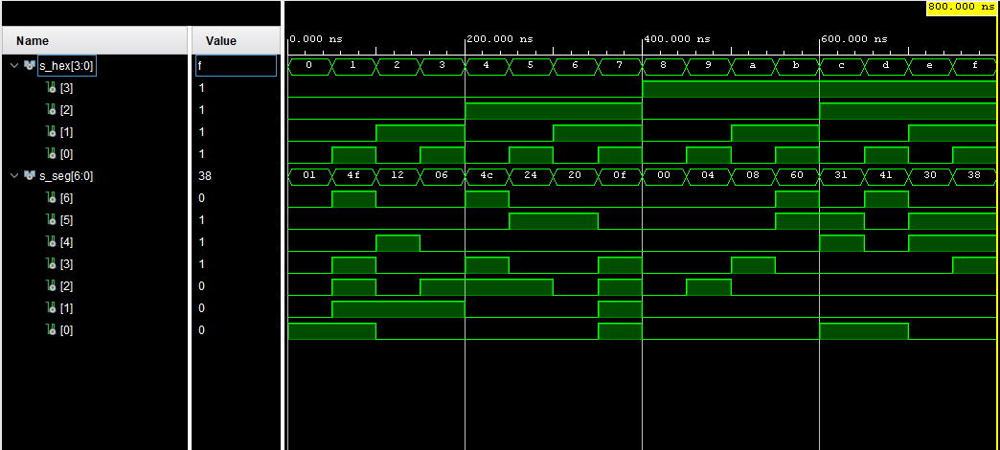
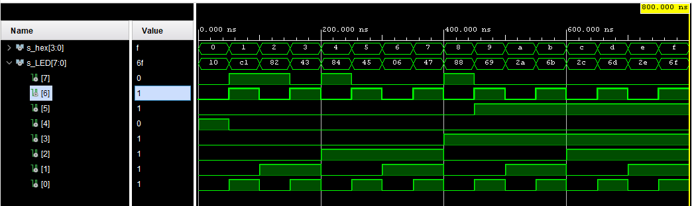

# Lab 4: Seven-segment display decoder

## 1.

**Figure or table with connection of 7-segment displays on Nexys A7 board.**

| Segment display / anoda | Označení na desce |
| ----------------------- | ----------------- |
| CA                      | T10               |
| CB                      | R10               |
| CC                      | K16               |
| CD                      | K13               |
| CE                      | P15               |
| CF                      | T11               |
| CG                      | L18               |
| DP                      | H15               |
| AN0                     | J17               |
| AN1                     | J18               |
| AN2                     | T9                |
| AN3                     | J14               |
| AN4                     | P14               |
| AN5                     | T14               |
| AN6                     | K2                |
| AN7                     | U13               |

**Decoder truth table for common anode 7-segment display.**

| **Hex** | **Inputs** | **A** | **B** | **C** | **D** | **E** | **F** | **G** |
| :-: | :-: | :-: | :-: | :-: | :-: | :-: | :-: | :-: |
| 0 | 0000 | 0 | 0 | 0 | 0 | 0 | 0 | 1 |
| 1 | 0001 | 1 | 0 | 0 | 1 | 1 | 1 | 1 |
| 2 | 0010 | 0 | 0 | 1 | 0 | 0 | 1 | 0 |
| 3 | 0011 | 0 | 0 | 0 | 0 | 1 | 1 | 0 |
| 4 | 0100 | 1 | 0 | 0 | 1 | 1 | 0 | 0 |
| 5 | 0101 | 0 | 1 | 0 | 0 | 1 | 0 | 0 |
| 6 | 0110 | 0 | 1 | 0 | 0 | 0 | 0 | 0 |
| 7 | 0111 | 0 | 0 | 0 | 1 | 1 | 1 | 1 |
| 8 | 1000 | 0 | 0 | 0 | 0 | 0 | 0 | 0 |
| 9 | 1001 | 0 | 0 | 0 | 0 | 1 | 0 | 0 |
| A | 1010 | 0 | 0 | 0 | 1 | 0 | 0 | 0 |
| b | 1011 | 1 | 1 | 0 | 0 | 0 | 0 | 0 |
| C | 1100 | 0 | 1 |   1   | 0 | 0 | 0 | 1 |
| d | 1101 | 1 | 0 | 0 | 0 | 0 | 0 | 1 |
| E | 1110 | 0 | 1 | 1 | 0 | 0 | 0 | 0 |
| F | 1111 | 0 | 1 | 1 | 1 | 0 | 0 | 0 |

## 2.

- **Listing of VHDL architecture from source file `hex_7seg.vhd` with syntax highlighting,**

```vhdl
architecture behavioral of hex_7seg is
begin

    p_7seg_decoder : process(hex_i)
    begin
        case hex_i is
            when "0000" =>
                seg_o <= "0000001";     -- 0
            when "0001" =>
                seg_o <= "1001111";     -- 1
                
            when "0010" =>
                seg_o <= "0010010";     -- 2
                
            when "0011" =>
                seg_o <= "0000110";     -- 3
            
            when "0100" =>
                seg_o <= "1001100";     -- 4
            
            when "0101" =>
                seg_o <= "0100100";     -- 5

            when "0110" =>
                seg_o <= "0100000";     -- 6
            
            when "0111" =>
                seg_o <= "0001111";     -- 7
            
            when "1000" =>
                seg_o <= "0000000";     -- 8
                
            when "1001" =>
                seg_o <= "0000100";     -- 9
            
            when "1010" =>
                seg_o <= "0001000";     --  A
            
            when "1011" =>
                seg_o <= "1100000";     -- b            

            when "1100" =>
                seg_o <= "0110001";     -- C
            
            when "1101" =>
                seg_o <= "1000001";     -- d
            
            when "1110" =>
                seg_o <= "0110000";     -- E
                
            when "1111" =>
                seg_o <= "0111000";     -- F
    
            -- WRITE YOUR CODE HERE

            when others =>
                seg_o <= "0111000";     -- F
        end case;
    end process p_7seg_decoder;

end architecture behavioral;
```

- Listing of VHDL stimulus process from testbench file `tb_hex_7seg.vhd` with syntax highlighting and asserts,

```vhdl
p_stimulus : process
           begin
                
                s_hex <= "0000"; 
                wait for 50ns;
                s_hex <= "0001"; 
                wait for 50ns;
                s_hex <= "0010"; 
                wait for 50ns;
                s_hex <= "0011"; 
                wait for 50ns;
                s_hex <= "0100"; 
                wait for 50ns;
                s_hex <= "0101"; 
                wait for 50ns;
                s_hex <= "0110"; 
                wait for 50ns;
                s_hex <= "0111"; 
                wait for 50ns;
                s_hex <= "1000"; 
                wait for 50ns;
                s_hex <= "1001"; 
                wait for 50ns;
                s_hex <= "1010"; 
                wait for 50ns;
                s_hex <= "1011"; 
                wait for 50ns;
                s_hex <= "1100"; 
                wait for 50ns;
                s_hex <= "1101"; 
                wait for 50ns;
                s_hex <= "1110"; 
                wait for 50ns;
                s_hex <= "1111"; 
                wait for 50ns;
                
                wait;
           end process p_stimulus;
```

- Screenshot with simulated time waveforms; always display all inputs and outputs,



- Listing of VHDL code from source file `top.vhd` with 7-segment module instantiation.

  
  ```vhdl
  entity top is
          Port ( 
      SW : in STD_LOGIC_vector ( 4 - 1 downto 0);
      LED : out STD_LOGIC_vector ( 8 - 1 downto 0);
      CA : out std_logic;
      CB : out std_logic;
      CC : out std_logic;
      CD : out std_logic;
      CE : out std_logic;
      CF : out std_logic;
      CG : out std_logic;
      AN : out STD_LOGIC_vector ( 8 - 1 downto 0)  
          );
  
  end top;
  
  architecture Behavioral of top is
  
  begin
  
   hex2seg : entity work.hex_7seg
          port map(
              hex_i    => SW,
              seg_o(6) => CA,
              seg_o(5) => CB,
              seg_o(4) => CC,
              seg_o(3) => CD,
              seg_o(2) => CE,
              seg_o(1) => CF,
              seg_o(0) => CG
          );
       
       AN <= b"1111_0111";
  
  end Behavioral;
  ```


- Truth table and listing of VHDL code for LEDs(7:4) with syntax highlighting,

| **Hex** | **Inputs** | **LED4** | **LED5** | **LED6** | **LED7** |
| :-: | :-: | :-: | :-: | :-: | :-: |
| 0 | 0000 | 0 | 1 | 1 | 1 |
| 1 | 0001 | 1 | 1 | 0 | 0 |
| 2 | 0010 | 1 | 1 | 1 | 0 |
| 3 | 0011 | 1 | 1 | 0 | 1 |
| 4 | 0100 | 1 | 1 | 1 | 0 |
| 5 | 0101 | 1 | 1 | 0 | 1 |
| 6 | 0110 | 1 | 1 | 1 | 1 |
| 7 | 0111 | 1 | 1 | 0 | 1 |
| 8 | 1000 | 1 | 1 | 1 | 0 |
| 9 | 1001 | 1 | 1 | 0 | 1 |
| A | 1010 | 1 | 0 | 1 | 1 |
| b | 1011 | 1 | 0 | 0 | 1 |
| C | 1100 | 1 | 0 | 1 | 1 |
| d | 1101 | 1 | 0 | 0 | 1 |
| E | 1110 | 1 | 0 | 1 | 1 |
| F | 1111 | 1 | 0 | 0 | 1 |

 ```vhdl
    LED(4) <= '1' when SW = "0000" else '0';
    LED(5) <= '1' when SW > "1001" else '0';
    LED(6) <= '1' when SW(0) = '1' else '0';
    LED(7) <= '1' when SW = "0001" or SW = "0010" or SW = "0100" or SW = "1000" else '0';
 ```

- Screenshot with simulated time waveforms; always display all inputs and outputs.

