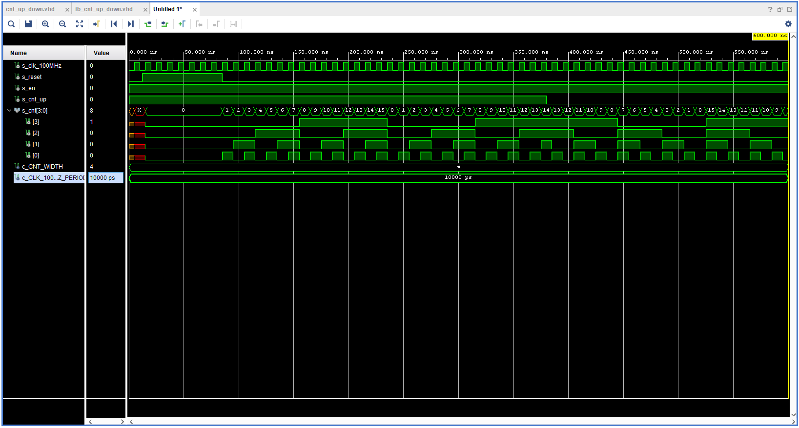
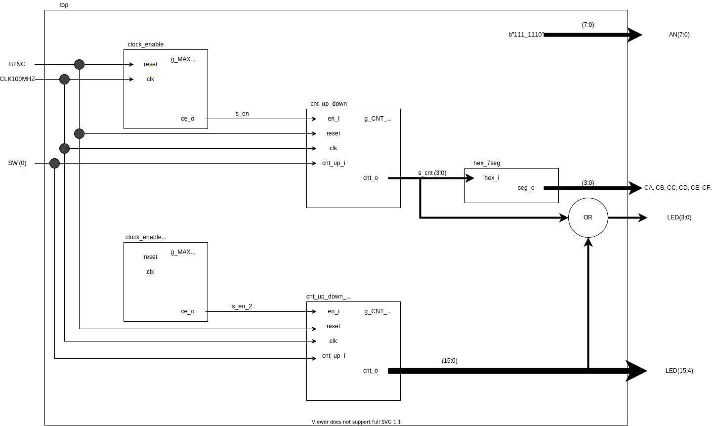

# Lab 5: Binary counter
1. Preparation tasks (done before the lab at home). Submit:
- Figure or table with connection of push buttons on Nexys A7 board,
| Button | Input on board | Voltage |
| :----: | :------------: | :-----: |
|  BTNL  |      P17       |  3,3 V  |
|  BTNR  |      M17       |  3,3 V  |
|  BTNU  |      M18       |  3,3 V  |
|  BTND  |      P18       |  3,3 V  |
|  BTNC  |      N17       |  3,3 V  |

- Table with calculated values.

| **Time interval** | **Number of clk periods** | **Number of clk periods in hex** | **Number of clk periods in binary** |
| :-: | :-: | :-: | :-: |
| 2&nbsp;ms | 200 000 | 30D40 | 110000110101000000 |
| 4&nbsp;ms |400 000|61A80|1100001101010000000|
| 10&nbsp;ms |1 000 000|F4240|11110100001001000000|
| 250&nbsp;ms |25 000 000|17D7840|1011111010111100001000000|
| 500&nbsp;ms |50 000 000|2FAF080|10111110101111000010000000|
| 1&nbsp;sec | 100 000 000 | 5F5E100 | 101111101011110000100000000 |

2. Bidirectional counter. Submit:

* Listing of VHDL code of the process `p_cnt_up_down` with syntax highlighting.
```vhdl
begin
    p_cnt_up_down : process(clk)
    begin
        if rising_edge(clk) then
        
            if (reset = '1') then               -- Synchronous reset
                s_cnt_local <= (others => '0'); -- Clear all bits

            elsif (en_i = '1') then       -- Test if counter is enabled


               if ( cnt_up_i = '1') then


                s_cnt_local <= s_cnt_local + 1;
            
               else 
                s_cnt_local <= s_cnt_local - 1;
      
         end if;


            end if;
        end if;
    end process p_cnt_up_down;

```


* Listing of VHDL reset and stimulus processes from testbench file `tb_cnt_up_down.vhd` with syntax highlighting and asserts,

```vhdl
    p_reset_gen : process
    begin
        s_reset <= '0';
        wait for 12 ns;
        
        -- Reset activated
        s_reset <= '1';
        wait for 73 ns;

        s_reset <= '0';
        wait;
    end process p_reset_gen;

    p_stimulus : process
    begin
        report "Stimulus process started" severity note;

        -- Enable counting
        s_en     <= '1';
        
        -- Change counter direction
        s_cnt_up <= '1';
        wait for 380 ns;
        s_cnt_up <= '0';
        wait for 220 ns;

        -- Disable counting
        s_en     <= '0';

        report "Stimulus process finished" severity note;
        wait;
    end process p_stimulus;
```


* Screenshot with simulated time waveforms; always display all inputs and outputs,



3. Top level. Submit:

* Listing of VHDL code from source file `top.vhd` with all instantiations for the 4-bit bidirectional counter.

```vhdl
library IEEE;
use IEEE.STD_LOGIC_1164.ALL;

entity top is
    Port ( CLK100MHZ : in STD_LOGIC;
           BTNC : in STD_LOGIC;
           SW : in STD_LOGIC_VECTOR (1-1 downto 0);
           LED : out STD_LOGIC_VECTOR (4-1 downto 0);
           CA : out STD_LOGIC;
           CB : out STD_LOGIC;
           CC : out STD_LOGIC;
           CD : out STD_LOGIC;
           CE : out STD_LOGIC;
           CF : out STD_LOGIC;
           CG : out STD_LOGIC;
           AN : out STD_LOGIC_VECTOR (8-1 downto 0));
end top;

architecture Behavioral of top is

    -- Internal clock enable
    signal s_en  : std_logic;
    -- Internal counter
    signal s_cnt : std_logic_vector(4 - 1 downto 0);

begin

    clk_en0 : entity work.clock_enable
        generic map(
            --- WRITE YOUR CODE HERE
            g_MAX => 100000000
        )
        port map(
            --- WRITE YOUR CODE HERE
            clk   => CLK100MHZ,  
            reset => BTNC,       
            ce_o  => s_en
        );

    bin_cnt0 : entity work.cnt_up_down
        generic map(
            --- WRITE YOUR CODE HERE
            g_CNT_WIDTH => 4
        )
        port map(
            --- WRITE YOUR CODE HERE
            clk      => CLK100MHZ,
            reset    => BTNC,
            en_i     => s_en,
            cnt_up_i => SW(0),
            cnt_o    => s_cnt
        );

    -- Display input value on LEDs
    LED(4-1 downto 0) <= s_cnt;


    hex2seg : entity work.hex_7seg
        port map(
            hex_i    => s_cnt,
            seg_o(6) => CA,
            seg_o(5) => CB,
            seg_o(4) => CC,
            seg_o(3) => CD,
            seg_o(2) => CE,
            seg_o(1) => CF,
            seg_o(0) => CG
        );

    -- Connect one common anode to 3.3V
    AN <= b"1111_1110";

end architecture Behavioral;

```


* Image of the top layer including both counters, ie a 4-bit bidirectional counter from Part 4 and a 16-bit counter with a 10 ms time base from Part Experiments on your own. The image can be drawn on a computer or by hand.



