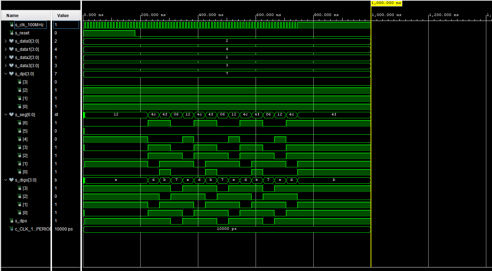

# Lab 6: Driver for multiple seven-segment displays

1. Preparation tasks (done before the lab at home). Submit:

   - Timing diagram figure for displaying value `3.142`.


2. Display driver. Submit:

   - Listing of VHDL code of the process `p_mux` with syntax highlighting.

   ```vhdl
       p_mux : process(s_cnt, data0_i, data1_i, data2_i, data3_i, dp_i)
       begin
           case s_cnt is
               when "11" =>
                   s_hex <= data3_i;
                   dp_o  <= dp_i(3);
                   dig_o <= "0111";
   
               when "10" =>
                   -- WRITE YOUR CODE HERE
                   s_hex <= data2_i;
                   dp_o  <= dp_i(2);
                   dig_o <= "1011";
   
               when "01" =>
                   -- WRITE YOUR CODE HERE
                   s_hex <= data1_i;
                   dp_o  <= dp_i(1);
                   dig_o <= "1101";
                   
               when "00" =>
                   s_hex <= data0_i;
                   dp_o  <= dp_i(0);
                   dig_o <= "1110";
   
               when others =>
                   -- WRITE YOUR CODE HERE
                   s_hex <= "1111";
                   dp_o  <= '0';
                   dig_o <= "1111";
                   
               
           end case;
       end process p_mux;
   ```

   - Listing of VHDL testbench file `tb_driver_7seg_4digits` with syntax highlighting and asserts,

    ```vhdl
       architecture testbench of tb_driver_7seg_4digits is
   
       constant c_CLK_100MHZ_PERIOD : time    := 10 ns;
   
       signal s_clk_100MHz : std_logic;
       signal s_reset  : std_logic;
       signal s_data0  : std_logic_vector(4 - 1 downto 0);
       signal s_data1  : std_logic_vector(4 - 1 downto 0);
       signal s_data2  : std_logic_vector(4 - 1 downto 0);
       signal s_data3  : std_logic_vector(4 - 1 downto 0);
       signal s_dpi    : std_logic_vector(4 - 1 downto 0);
       signal s_seg  : std_logic_vector(7 - 1 downto 0);
       signal s_digo  : std_logic_vector(4 - 1 downto 0);
       signal s_dpo  : std_logic;
   
   begin
   
   uut_top : entity work.driver_7seg_4digits
         port map(
              clk    => s_clk_100MHz,
              reset => s_reset,
                         
               data0_i => s_data0,
               data1_i => s_data1,
               data2_i => s_data2,
               data3_i => s_data3,
           -- 4-bit input value for decimal points
               dp_i    => s_dpi,
           -- Decimal point for specific digit
               dp_o    => s_dpo,
           -- Cathode values for individual segments
               seg_o   => s_seg, 
           -- Common anode signals to individual displays
               dig_o   => s_digo
   
   
           );
   
       p_reset_gen : process
       begin
           s_reset <= '1';
           wait for 128 ns;
           
           -- Reset activated
           s_reset <= '1';
           wait for 53 ns;
   
           -- Reset deactivated
           s_reset <= '0';
   
           wait;
       end process p_reset_gen;
       
           p_clk_gen : process
       begin
           while now < 750 ns loop         -- 75 periods of 100MHz clock
               s_clk_100MHz <= '0';
               wait for c_CLK_100MHZ_PERIOD / 2;
               s_clk_100MHz <= '1';
               wait for c_CLK_100MHZ_PERIOD / 2;
           end loop;
           wait;
       end process p_clk_gen;
   
       
       
       p_stimulus : process
       begin
           report "Stimulus process started" severity note;
            
           s_data0 <= "0011";
           s_data1 <= "0001";
           s_data2 <= "0100";
           s_data3 <= "0010";
           
           s_dpi <= "0111";
           
           report "Stimulus process finished" severity note;
           wait;
       end process p_stimulus; 
           
   end testbench;
    ```

   - Screenshot with simulated time waveforms; always display all inputs and outputs,
     - *Display only important inputs because all of them wouldn't fit the screen.*
  - *Time of "clock enable" is shorted to only g_MAX = 4 to make simulation more readable and shorten simulation time.* 
   

   
   - Listing of VHDL architecture of the top layer.

```vhdl
architecture Behavioral of top is
    -- No internal signals
begin
    driver_seg_4 : entity work.driver_7seg_4digits
        port map(
            clk        => CLK100MHZ,
            reset      => BTNC,
            data0_i(3) => SW(3),
            data0_i(2) => SW(2),
            data0_i(1) => SW(1),
            data0_i(0) => SW(0),
            --- WRITE YOUR CODE HERE
            data1_i(3) => SW(7),
            data1_i(2) => SW(6),
            data1_i(1) => SW(5),
            data1_i(0) => SW(4),
            
            data2_i(3) => SW(11),
            data2_i(2) => SW(10),
            data2_i(1) => SW(9),
            data2_i(0) => SW(8),
            
            data3_i(3) => SW(15),
            data3_i(2) => SW(14),
            data3_i(1) => SW(13),
            data3_i(0) => SW(12),
            
            dp_i => "0111",
            --- WRITE YOUR CODE HERE
            seg_o(0) => CA,
            seg_o(1) => CB,
            seg_o(2) => CC,
            seg_o(3) => CD,
            seg_o(4) => CE,
            seg_o(5) => CF,
            seg_o(6) => CG,
            
            dig_o    => AN (4-1 downto 0),
            dp_o     => DP
        );

    -- Disconnect the top four digits of the 7-segment display
    AN(7 downto 4) <= b"1111";

end architecture Behavioral;
```
3. Eight-digit driver. Submit:

   - Image of the driver schematic. The image can be drawn on a computer or by hand.

   

   

   
