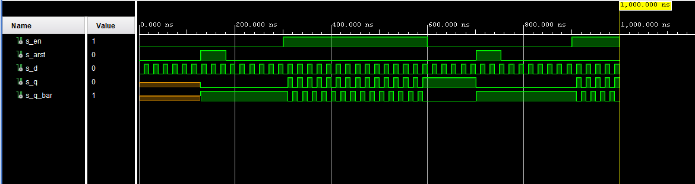
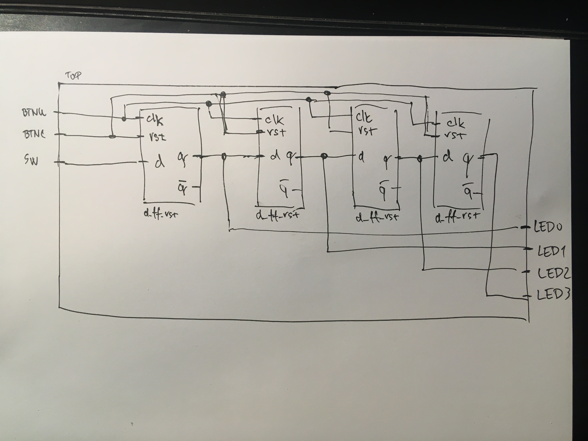

# Lab 7: Latches and Flip-flops

## Preparation tasks (done before the lab at home)
1. Preparation tasks (done before the lab at home). Submit:
    * Characteristic equations and completed tables for D, JK, T flip-flops.


Write characteristic equations and complete truth tables for D, JK, T flip-flops where `Qn` represents main output value before clock edge and `Q(n+1)` represents value after the edge.

| **D** | **Qn** | **Q(n+1)** | **Comments** |
| :-: | :-: | :-: | :-- |
| 0 | 0 | 0 | Qn |
| 0 | 1 | 1 | Qn |
| 1 | 0 | 0 | stored |
| 1 | 1 | 1 | stored |

| **J** | **K** | **Qn** | **Q(n+1)** | **Comments** |
| :-: | :-: | :-: | :-: | :-- |
| 0 | 0 | 0 | 0 | No change |
| 0 | 0 | 1 | 1 | No change |
| 0 | 1 | 0 | 0 | q(n+1) = 0 |
| 0 | 1 | 1 | 0 | q(n+1) = 0 |
| 1 | 0 | 0 | 1 | q(n+1) = /q(n+1) + q(n) = 1 |
| 1 | 0 | 1 | 1 | q(n+1) = /q(n+1) + q(n) = 1 |
| 1 | 1 | 0 | 1 | q(n+1) = /q(n+1) = 1 |
| 1 | 1 | 1 | 0 | q(n+1) = /q(n+1) = 0 |

| **T** | **Qn** | **Q(n+1)** | **Comments** |
| :-: | :-: | :-: | :-- |
| 0 | 0 | 0 | No change |
| 0 | 1 | 1 | No change |
| 1 | 0 | 1 | Invert |
| 1 | 1 | 0 | Invert |

2. D latch. Submit:
    * VHDL code listing of the process `p_d_latch` with syntax highlighting,
```vhdl
    p_d_latch : process (en, arst, d)
    begin
        if (arst = '1') then
            q <= '0';
            q_bar <= '1';
        elsif (en = '1') then
            q <= d; 
            q_bar <= not d;
            
        end if;
    end process p_d_latch;
```


* Listing of VHDL reset and stimulus processes from the testbench `tb_d_latch` file with syntax highlighting and asserts,
```vhdl
       p_reset_gen : process
    begin
        s_arst <= '0';
        wait for 128 ns;
        
        -- Reset activated
        s_arst <= '1';
        wait for 53 ns;

        -- Reset deactivated
        s_arst <= '0';
        
        wait for 520 ns;
        
        -- Reset activated
        s_arst <= '1';
        wait for 53 ns;

        -- Reset deactivated
        s_arst <= '0';
        
        wait;
    end process p_reset_gen;
        
        
        
            p_stimulus : process
    begin
        report "Stimulus process started" severity note;

        
        
        s_en <= '0';
        s_d <= '0';
       while now < 300 ns loop
        s_d <= '0';
        wait for 10 ns;
        s_d <= '1';
        wait for 10 ns;
        end loop;
        
        s_en <= '1';
       
        while now < 600 ns loop
            s_d <= '0';
            wait for 10 ns;
            s_d <= '1';
            wait for 10 ns;
        end loop;
        
        
        s_en <= '0';
        s_d <= '1';
        while now < 900 ns loop
            s_d <= '0';
            wait for 10 ns;
            s_d <= '1';
            wait for 10 ns;
        end loop;    
        
        
        
        s_en <= '1';
        s_d <= '1';
        while now < 1200 ns loop
            s_d <= '0';
            wait for 10 ns;
            s_d <= '1';
            wait for 10 ns;
        end loop;           
       
        
        report "Stimulus process finished" severity note;
        wait;
    end process p_stimulus;
```


* Screenshot with simulated time waveforms; always display all inputs and outputs. The full functionality of the entity must be verified.

  

3. Flip-flops. Submit:
    * VHDL code listing of the processes `p_d_ff_arst`, `p_d_ff_rst`, `p_jk_ff_rst`, `p_t_ff_rst` with syntax highlighting,


```vhdl
    p_d_ff_arst : process (clk, arst)
    begin
        if (arst = '1') then
            q <= '0';
            q_bar <= '1';
        elsif rising_edge(clk) then
            q <= d; 
            q_bar <= not d;
            
        end if;
    end process p_d_ff_arst;
            
            
            
	p_d_ff_rst : process (clk, rst)
    begin
        if rising_edge(clk) then
            if (rst = '1') then
                q <= '0';
                q_bar <= '1';
            else
                q <= d;
                q_bar <= not d;
                      
            end if;
        end if;
        
    end process p_d_ff_rst;
        
            
            
   p_jk_ff_rst : process (clk)
   begin
        if rising_edge(clk) then
            if (rst = '1') then
                s_q <= '0';
            else
                if(j = '0' and k = '0') then
                    s_q <= s_q;
                elsif(j = '1' and k = '0') then
                    s_q <= '1';
                elsif(j = '0' and k = '1') then
                    s_q <= '0';
                elsif(j = '1' and k = '1') then
                    s_q <= not s_q;
                end if;
           end if;
        end if;
    end process p_jk_ff_rst;
            
            
            
    p_t_ff_rst : process (clk, rst)
    begin
        if rising_edge(clk) then
            if (rst = '1') then
                s_q <= '0';
                q_bar <= '1';
            elsif (t = '0') then
                s_q <= s_q;
            elsif (t= '1') then
                s_q <= not s_q;
                      
            end if;
            
        end if;
        
    end process p_t_ff_rst;
```

* Listing of VHDL clock, reset and stimulus processes from the testbench files with syntax highlighting and asserts,


```vhdl
	p_clk_gen : process
    begin
        while now < 750 ns loop         -- 75 periods of 100MHz clock
            s_clk <= '0';
            wait for 10ns / 2;
            s_clk <= '1';
            wait for 10ns / 2;
        end loop;
        wait;
    end process p_clk_gen;

    p_reset_gen : process
    begin
        s_rst <= '0';
        wait for 128 ns;
        
        -- Reset activated
        s_rst <= '1';
        wait for 53 ns;

        -- Reset deactivated
        s_rst <= '0';

        wait;
    end process p_reset_gen;

    p_stimulus : process
    begin
        report "Stimulus process started" severity note;

        
        
        s_en <= '0';
        s_d <= '0';
       while now < 300 ns loop
        s_d <= '0';
        wait for 36 ns;
        s_d <= '1';
        wait for 36 ns;
        end loop;
        
        s_en <= '1';
       
        while now < 600 ns loop
            s_d <= '0';
            wait for 36 ns;
            s_d <= '1';
            wait for 36 ns;
        end loop;
        
        
        s_en <= '0';
      
        while now < 900 ns loop
            s_d <= '0';
            wait for 10 ns;
            s_d <= '1';
            wait for 10 ns;
        end loop;    
        
        
        
        s_en <= '1';
       
        while now < 1200 ns loop
            s_d <= '0';
            
             wait for 10 ns;
            s_d <= '1';
            wait for 10 ns;
        end loop;           
       
        
        report "Stimulus process finished" severity note;
        wait;
    end process p_stimulus;
```

4. Shift register. Submit:
   
    * Image of the shift register schematic. The image can be drawn on a computer or by hand. Name all inputs, outputs, components and internal signals.



